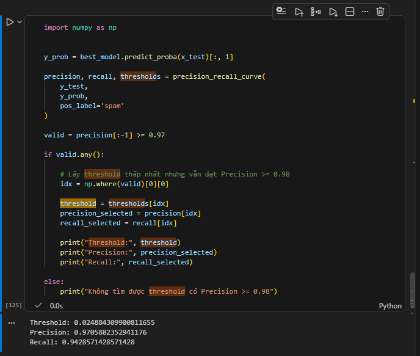

# Báo cáo phân tích: Naive Bayes cho bài toán phân loại Spam SMS

## 1. Bảng so sánh các tổ hợp Vectorizer × Naive Bayes

| Model                             | F1 Macro   | Alpha | Ngram | Min DF | Max DF |
| --------------------------------- | ---------- | ----- | ----- | ------ | ------ |
| CountVectorizer + MultinomialNB   | 0.9694     | 0.5   | (1,1) | 2      | 0.8    |
| TfidfVectorizer + MultinomialNB   | 0.9676     | 0.1   | (1,1) | 4      | 0.8    |
| **TfidfVectorizer + BernoulliNB** | **0.9728** | 0.1   | (1,1) | 4      | 0.8    |

> Tổ hợp **TF-IDF + BernoulliNB** cho F1 Macro cao nhất, được chọn làm cấu hình tốt nhất trong nhóm Naive Bayes.

---

## 2. Top từ có xác suất log cao nhất trong lớp SPAM

| #   | Từ     | Log-probability |
| --- | ------ | --------------- |
| 1   | to     | -0.4658         |
| 2   | call   | -0.8603         |
| 3   | you    | -1.1161         |
| 4   | your   | -1.1463         |
| 5   | for    | -1.3571         |
| 6   | now    | -1.4196         |
| 7   | or     | -1.4523         |
| 8   | free   | -1.5036         |
| 9   | the    | -1.5036         |
| 10  | is     | -1.6345         |
| 11  | txt    | -1.6753         |
| 12  | from   | -1.7397         |
| 13  | have   | -1.8087         |
| 14  | text   | -1.8327         |
| 15  | mobile | -1.8450         |
| 16  | on     | -1.8574         |
| 17  | ur     | -1.8956         |
| 18  | claim  | -1.9353         |
| 19  | reply  | -1.9626         |
| 20  | and    | -1.9626         |

> Các từ như **call, free, txt, claim, reply, mobile, ur** phản ánh rõ đặc trưng ngôn ngữ quảng cáo/spam SMS.

---

## 3. Vì sao alpha = 0 gây vấn đề?

Naive Bayes ước lượng xác suất một từ xuất hiện trong một lớp dựa trên tần suất xuất hiện trong tập huấn luyện. Nếu một từ chưa từng xuất hiện trong lớp đó, xác suất tương ứng sẽ bằng 0.

Vì xác suất của toàn bộ văn bản được tính bằng **tích** các xác suất từ, chỉ cần một từ có xác suất 0 sẽ khiến xác suất của cả lớp bằng 0 — dù các từ khác có mạnh đến đâu.

Việc thêm hệ số làm mượt (**alpha > 0**, Laplace/Lidstone smoothing) giúp tránh hiện tượng này bằng cách đảm bảo không từ nào có xác suất tuyệt đối bằng 0.

---

## 4. Ngưỡng phân loại đạt Precision ≥ 0.97

Với **threshold = 0.02**, mô hình đạt Precision ≥ 0.97 trên lớp Spam. Còn theo đề bài với Precision ≥ 98 thì threshold = 0.0658

---

## 5. Phân tích các trường hợp dự đoán sai

**False Negative (Spam → Ham) — lỗi chủ yếu của mô hình:**

- Một số tin Spam sử dụng ngôn ngữ tự nhiên, viết tắt, hoặc có nội dung gần giống tin nhắn thông thường, khiến các từ đặc trưng Spam không đủ mạnh để mô hình nhận diện.
- Việc chọn threshold cao để đạt Precision ≥ 0.97 khiến mô hình thận trọng hơn khi dự đoán Spam, làm tăng khả năng bỏ sót Spam thật.

**False Positive (Ham → Spam):**

- Xuất hiện khi tin Ham chứa các từ thường liên quan đến quảng cáo, tiền bạc hoặc hình ảnh (`deal`, `deposit`, `pic`...), khiến mô hình nhầm lẫn với đặc trưng của Spam.

---

## 6. So sánh Logistic Regression vs TF-IDF + BernoulliNB

| Tiêu chí         | Logistic Regression | BernoulliNB |
| ---------------- | ------------------- | ----------- |
| Precision (spam) | 0.99                | 0.99        |
| Recall (spam)    | 0.93                | 0.91        |
| F1-score (spam)  | 0.96                | 0.95        |
| Accuracy         | 0.99                | 0.99        |

**Kết luận:** Cả hai mô hình đều giữ Precision cao (0.99), gần như không chặn nhầm tin Ham. Tuy nhiên, **Logistic Regression tốt hơn** nhờ Recall và F1 cao hơn — bắt được nhiều tin Spam thật hơn với cùng độ chính xác.

> ✅ **Chọn Logistic Regression làm mô hình cuối cùng.**

---

## 7. Thời gian huấn luyện và dự đoán

| Model               | Thời gian huấn luyện | Thời gian dự đoán |
| ------------------- | -------------------- | ----------------- |
| Naive Bayes         | 0.08 s               | 4.7580 ms         |
| Logistic Regression | 0.4466 s             | 6.5099 ms         |

> Naive Bayes nhanh hơn đáng kể ở cả huấn luyện lẫn dự đoán, nhưng Logistic Regression đánh đổi tốc độ để lấy hiệu năng phân loại tốt hơn (Recall, F1 cao hơn).

## 8. feature phụ message_length

Trộn message_length thô (chưa chuẩn hoá) với TF-IDF/CountVectorizer vào MultinomialNB cũng không đúng bản chất xác suất (MultinomialNB kỳ vọng đặc trưng là "đếm sự kiện rời rạc", không phải một số liên tục lớn). Vẫn chạy được về mặt kỹ thuật nhưng sai giả định mô hình — Nó có thể giúp ích vì nó vẫn ở dạng số nguyên lớn và có thể có mối tương quan hoặc giúp ích gì đó cho model học hỏi và dự đoán. Chúng ta có thể thử nghiệm có message_length hoặc không cần. Nhưng ở đây thì nó không giúp ích gì nhiều
