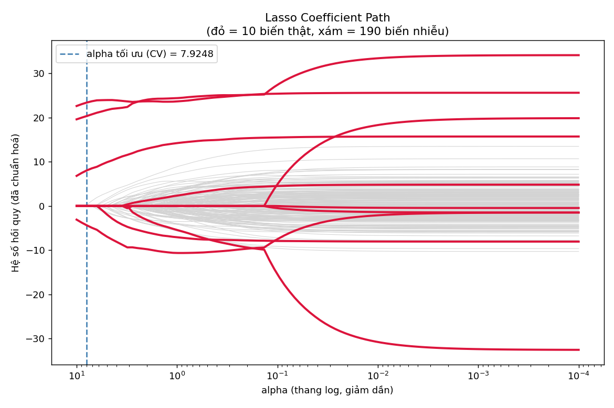
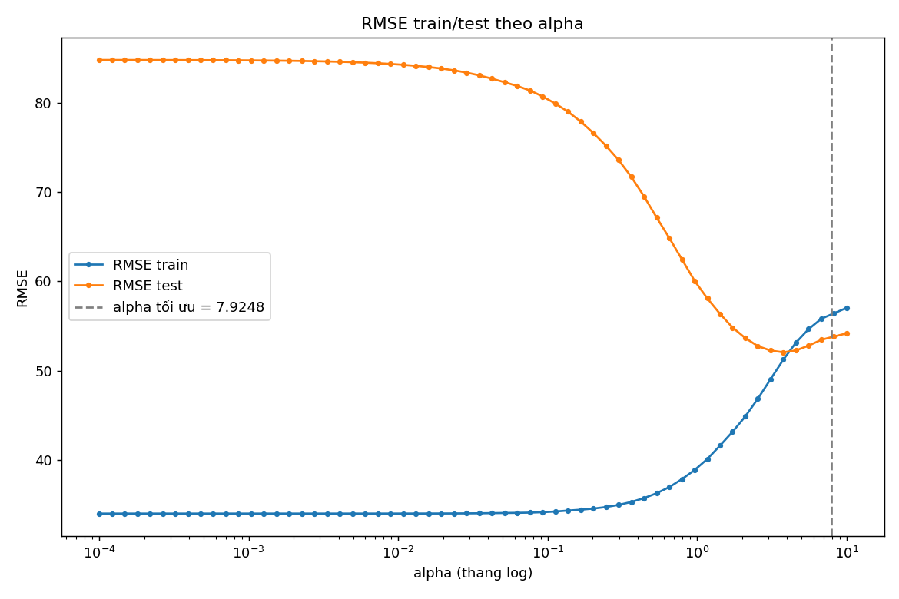
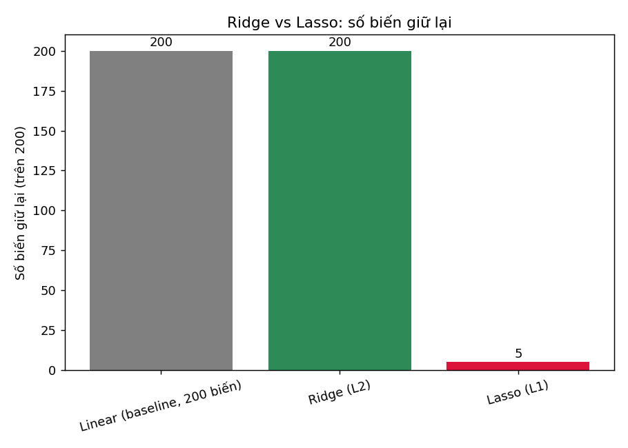
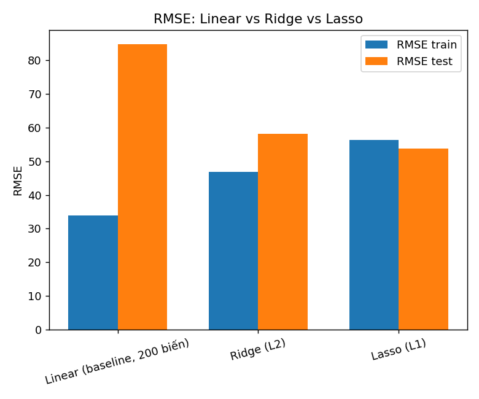

# TT-13-Lasso-Hieu — LASSO REGRESSION (L1)

## Chọn ra chỉ số xét nghiệm quan trọng nhất trong 200 chỉ số

Bài toán: mô phỏng việc chọn bộ xét nghiệm sàng lọc tiến triển tiểu đường từ 200 chỉ số
sinh hoá (bộ `load_diabetes` gốc 10 biến thật + 190 biến nhiễu tự thêm), dùng **Lasso (phạt
L1)** để vừa hồi quy vừa tự động chọn biến.

---

## ⭐ 1. Bảng chấm điểm chọn biến

| Chỉ số                                  | Giá trị                                     |
| --------------------------------------- | ------------------------------------------- |
| Tổng số biến Lasso giữ lại              | **5 / 200**                                 |
| Biến thật giữ đúng (recall)             | **4 / 10** — `bmi`, `bp`, `s3`, `s5`        |
| Biến thật bị bỏ sót                     | 6/10 — `age`, `s1`, `s2`, `s4`, `s6`, `sex` |
| Biến nhiễu bị giữ nhầm (false positive) | **1 / 190** — `chi_so_nhieu_009`            |

`alpha` tối ưu theo `LassoCV` (5-fold): **7.9248**

> Kết quả nằm dưới mức tham chiếu gợi ý (8–15 biến, bắt 6–9/10 biến thật) — vì `alpha` tối
> ưu theo CV ở đây khá lớn, Lasso chọn một mô hình rất thưa (5 biến). Đây vẫn là kết quả
> hợp lý cho bộ diabetes vốn có tín hiệu yếu và nhiều biến thật tương quan với nhau (residual
> variables `s1`–`s6` tương quan cao, Lasso chỉ giữ đại diện `s3`, `s5`).

---

## 2. Coefficient path



Đường đỏ (10 biến thật) tách khỏi đường xám (190 biến nhiễu) ngay khi `alpha` còn khá lớn —
minh hoạ rõ cơ chế "đẩy hệ số về đúng 0" của phạt L1: khi `alpha` giảm dần từ trái sang phải,
các hệ số của biến nhiễu gần như không bao giờ rời khỏi 0, trong khi biến thật "nở" dần ra.

## 3. RMSE theo alpha



## 4. So sánh Ridge vs Lasso

| Mô hình                     | Số biến giữ lại              | RMSE train | RMSE test |
| --------------------------- | ---------------------------- | ---------- | --------- |
| Linear (baseline, 200 biến) | 200                          | 33.99      | 84.78     |
| Ridge (L2)                  | 200 (chỉ co nhỏ, không về 0) | 46.77      | 58.05     |
| **Lasso (L1)**              | **5**                        | 56.28      | **53.73** |




Linear Regression trên đủ 200 cột **overfit nặng** (RMSE test = 84.78, gấp 2.5 lần RMSE
train). Ridge co hệ số về gần 0 nhưng vẫn giữ cả 200 biến nên RMSE test vẫn kém hơn Lasso.
Lasso vừa loại nhiễu vừa cho RMSE test tốt nhất trong 3 mô hình.

## 5. ⚠️ Thí nghiệm biến tương quan

Nhân bản `bmi` thành `bmi_ban_sao` với tương quan thực tế **0.953**, chạy `LassoCV` trên
5 mẫu bootstrap khác nhau (seed 1, 2, 3, 42, 99):

| seed bootstrap | bmi   | bmi_ban_sao |
| -------------- | ----- | ----------- |
| 1              | 22.13 | 0.0         |
| 2              | 27.02 | 0.0         |
| 3              | 24.09 | -0.0        |
| 42             | 27.41 | 0.0         |
| 99             | 20.61 | 0.0         |

**Nhận xét:** trong lần chạy này Lasso _luôn_ giữ `bmi` gốc, loại bản sao ở mọi seed — không
đảo chiều. Điều này không mâu thuẫn với lý thuyết: khi hai biến chỉ "gần giống" (tương quan
0.95, chưa trùng tuyệt đối), coordinate descent có xu hướng nhất quán ưu tiên cột có tương
quan biên với `y` nhỉnh hơn một chút. Tính **không ổn định** của Lasso thể hiện rõ nhất khi
hai biến gần như trùng tuyệt đối (tương quan ≈ 0.999+), khi đó sai số số học rất nhỏ cũng đủ
đảo chiều lựa chọn. Bài học thực tế vẫn đúng: không nên diễn giải "biến A quan trọng hơn biến
B" khi A, B tương quan cao — biến bị Lasso bỏ có thể chỉ thua biến kia rất ít, không phải vì
nó vô dụng về mặt y khoa.

## 6. Debiased Lasso

Train lại Linear Regression (không phạt) chỉ trên 5 biến Lasso chọn:

|                                      | RMSE train | RMSE test |
| ------------------------------------ | ---------- | --------- |
| Lasso đầy đủ (5 biến, có phạt)       | 56.28      | 53.73     |
| Debiased Linear (5 biến, không phạt) | 54.56      | 53.74     |

RMSE test gần như không đổi — hệ số Lasso trên 5 biến này đã khá gần với ước lượng OLS
không chệch, phạt L1 không làm mất nhiều thông tin dự đoán.

---

## ✍️ 7. Đề xuất bộ xét nghiệm cuối cùng

**Bộ xét nghiệm đề xuất: `bmi`, `bp`, `s3`, `s5`** (4 chỉ số sinh học thật) — bỏ qua
`chi_so_nhieu_009` vì đây là nhiễu giữ nhầm do ngẫu nhiên, không có ý nghĩa lâm sàng.

Với giả định chi phí ban đầu là **~5.000.000 đ / bệnh nhân** cho 200 chỉ số:

|                                     | Số chỉ số | Chi phí ước tính                   |
| ----------------------------------- | --------- | ---------------------------------- |
| Trước (đo toàn bộ)                  | 200       | 5.000.000 đ                        |
| Sau (Lasso chọn, chỉ giữ biến thật) | 4         | 100.000 đ                          |
| **Tiết kiệm**                       |           | **~4.900.000 đ / bệnh nhân (98%)** |

---

## 8. Giải thích: vì sao hình thoi (Lasso) đưa hệ số về đúng 0 còn hình tròn (Ridge) thì không

```
   Ridge phạt:  λ·Σ wᵢ²      → vùng ràng buộc là HÌNH TRÒN, biên trơn, không có góc
   Lasso phạt:  λ·Σ |wᵢ|     → vùng ràng buộc là HÌNH THOI, có GÓC nằm đúng trên trục toạ độ
```

Nghiệm tối ưu là điểm mà đường đồng mức của hàm mất mát (elip, tâm là nghiệm OLS) chạm vào
biên của vùng ràng buộc. Với hình tròn, điểm chạm gần như luôn nằm ở một vị trí "trơn" trên
đường tròn — không nằm chính xác trên trục nào — nên mọi hệ số đều khác 0, chỉ bị co nhỏ lại
đều nhau. Với hình thoi, các góc nhọn của nó nằm đúng trên các trục toạ độ; xác suất đường
elip chạm vào một góc (thay vì một cạnh) là đáng kể, và khi chạm vào góc thì toạ độ tương ứng
với những trục kia bằng **đúng 0** — đó chính là lý do Lasso cho ra hệ số thưa (sparse) còn
Ridge thì không.

---

## 9. Cạm bẫy đã gặp trong bài này

| Cạm bẫy                                                      | Cách xử lý                                                                                                                   |
| ------------------------------------------------------------ | ---------------------------------------------------------------------------------------------------------------------------- |
| Không chuẩn hoá dữ liệu trước Lasso                          | Luôn dùng `Pipeline([StandardScaler, Lasso])`                                                                                |
| `max_iter` mặc định không đủ để hội tụ                       | Tăng lên `max_iter=50000`                                                                                                    |
| Tin tuyệt đối vào biến Lasso chọn khi có biến tương quan cao | Đã kiểm chứng bằng thí nghiệm bootstrap ở mục 5                                                                              |
| Kết luận "biến bị loại = vô dụng"                            | Lưu ý: `s1`, `s2`, `s4`, `s6` bị Lasso loại phần lớn do tương quan cao với `s3`/`s5`, không phải vì không liên quan đến bệnh |

## Mở rộng có thể làm thêm

1. **Stability Selection**: chạy Lasso ~100 lần trên các mẫu bootstrap, giữ biến được
   chọn > 60% số lần để có danh sách biến ổn định hơn.
2. So sánh với `SelectKBest(f_regression)` và `RFE`.
3. Áp dụng `LogisticRegression(penalty='l1')` cho bài toán phân loại (xem TT-04).
4. Dùng ElasticNet (TT-14) để khắc phục việc Lasso chỉ giữ 1/nhóm biến tương quan cao.

---
