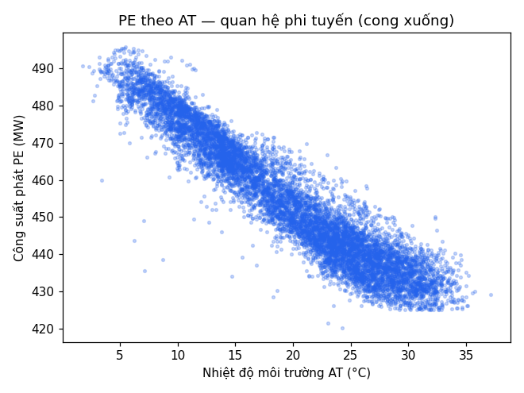
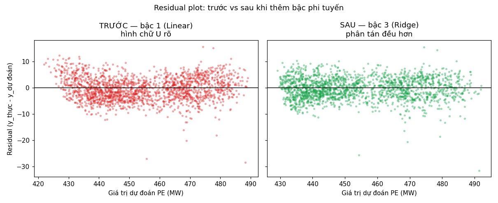
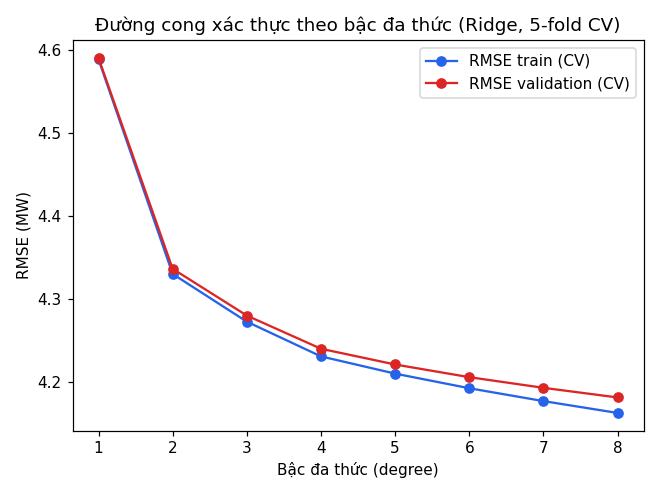

# TT-15 — POLYNOMIAL REGRESSION

## Quan hệ nhiệt độ ↔ công suất nhà máy điện là ĐƯỜNG CONG, không phải đường thẳng

## 1. EDA — quan hệ cong bằng mắt



Nhiệt độ môi trường (`AT`) càng cao, công suất phát (`PE`) càng giảm — nhưng theo đường **cong**, không tuyến tính đều: đoạn AT thấp (2–15°C) độ dốc thoải hơn hẳn đoạn AT cao (25–37°C), nơi hiệu suất tua-bin khí sụt nhanh.

Kiểm tra tương quan xác nhận đúng như README gốc cảnh báo: `AT` và `V` tương quan **r ≈ 0,844** — đa cộng tuyến đáng kể, sẽ nặng hơn nữa sau khi tạo đặc trưng đa thức.

---

## 2. Baseline — Linear Regression bậc 1

|              | RMSE train | RMSE test |
| ------------ | ---------- | --------- |
| Linear bậc 1 | 4,589 MW   | 4,428 MW  |

## 3. ⭐ Residual plot — TRƯỚC và SAU



- **Trước (bậc 1):** phần dư có hình **chữ U** rõ — dự đoán thấp hơn thực tế ở hai đầu dải PE (dưới 440 MW và trên 470 MW), cao hơn thực tế ở giữa dải. Đây chính là bằng chứng thiếu thành phần phi tuyến.
- **Sau (bậc 3, Ridge):** phần dư phân tán đều quanh 0 hơn hẳn, không còn hình dạng hệ thống rõ rệt — mô hình đã bắt được phần lớn độ cong.

## 4. Quét bậc 1→8 + đường cong xác thực

| degree | số cột (PolynomialFeatures) | RMSE train (Linear) | RMSE test (Linear) | RMSE train (Ridge) | RMSE test (Ridge) |
| ------ | --------------------------- | ------------------- | ------------------ | ------------------ | ----------------- |
| 1      | 4                           | 4,589               | 4,428              | 4,589              | 4,428             |
| 2      | 14                          | 4,282               | 4,147              | 4,328              | 4,173             |
| 3      | 34                          | 4,178               | 4,040              | 4,267              | 4,100             |
| 4      | 69                          | 4,105               | 4,002              | 4,228              | 4,073             |
| 5      | 125                         | 3,989               | 3,916              | 4,208              | 4,060             |
| 6      | 209                         | 3,926               | 3,948              | 4,190              | 4,047             |
| 7      | 329                         | 3,840               | 3,973              | 4,175              | 4,033             |
| 8      | 494                         | 3,780               | **4,708**          | 4,161              | 4,019             |



**Quan sát quan trọng:**

- Ở **Linear thuần**, RMSE test giảm dần đến bậc 7 rồi **bật tăng đột ngột ở bậc 8** (3,973 → 4,708) — dấu hiệu overfit kinh điển khi số cột (494) đã quá lớn so với khả năng khái quát hoá.
- Ở **Ridge**, đường RMSE test vẫn giảm mượt và không bị bật tăng — regularization đang chống đa cộng tuyến (do `AT`–`V` tương quan cao) và chống overfit hiệu quả.
- Đường cong xác thực gần như **phẳng từ bậc 3 trở đi** (bậc 3→8 chỉ chênh ~0,1 MW RMSE-val). Vì vậy dù bậc 8 (Ridge) có RMSE-val thấp nhất về mặt số học, ta **chọn bậc 3 làm model triển khai thực tế** — vừa đạt RMSE gần tối ưu, vừa đơn giản, dễ diễn giải và ít rủi ro khi ngoại suy hơn nhiều so với bậc 8 (xem mục 6).

## 5. Linear vs Ridge ở bậc cao (4–5)

| degree | RMSE test Linear    | RMSE test Ridge     | Ridge cứu được                                     |
| ------ | ------------------- | ------------------- | -------------------------------------------------- |
| 4      | 4,002               | 4,073               | Ridge cao hơn một chút ở bậc 4 (chưa overfit nặng) |
| 5      | 3,916               | 4,060               | tương tự                                           |
| 8      | **4,708** (overfit) | **4,019** (ổn định) | Ridge cứu ~0,69 MW RMSE và tránh sụp hoàn toàn     |

Ở bậc thấp (4–5), Linear thuần vẫn generalize tốt nên Ridge chưa thể hiện rõ lợi thế (thậm chí regularize hơi quá tay). Lợi ích của Ridge chỉ thực sự rõ khi số cột tăng vọt (bậc 7–8), đúng như lý thuyết dự đoán.

## 6. ⭐ Ngoại suy ngoài dải dữ liệu (AT = 50°C)

Dữ liệu thực tế: `AT` chỉ trong khoảng 1,81–37,11°C, `PE` chỉ trong khoảng 420,26–495,76 MW.

| Model                     | Dự đoán trong dải | Dự đoán ngoại suy AT=50°C | Lệch           |
| ------------------------- | ----------------- | ------------------------- | -------------- |
| Bậc 3 (Ridge, model cuối) | 436,96 MW         | 434,43 MW                 | −2,53          |
| Bậc 8 + Ridge             | 436,40 MW         | 398,33 MW                 | −38,08         |
| Bậc 8 + Linear thuần      | 437,83 MW         | **61.506,77 MW**          | **+61.068,94** |

Linear thuần bậc 8 cho ra một con số **phi lý tuyệt đối** (hơn 61 nghìn MW, trong khi nhà máy thật chỉ phát tối đa ~496 MW) — minh hoạ trực quan hiện tượng đa thức bậc cao "phát điên" khi ngoại suy. Ridge kiềm chế hệ số nên đỡ cực đoan hơn nhiều nhưng vẫn lệch xa dải thực tế ở bậc 8. Model bậc 3 ổn định nhất trong ba lựa chọn — thêm một lý do để ưu tiên bậc thấp hơn khi có thể.

**Bài học:** không nên dùng polynomial regression để dự đoán ngoài dải dữ liệu đã huấn luyện, dù có regularization hay không.

## 7. So sánh với Random Forest (TT-17)

| Model                         | RMSE test    | R²         |
| ----------------------------- | ------------ | ---------- |
| Polynomial bậc 3 + Ridge      | 4,100 MW     | 0,9413     |
| **Random Forest (300 trees)** | **3,175 MW** | **0,9648** |

Random Forest vượt trội hơn vì bắt được tương tác phi tuyến phức tạp giữa 4 biến mà không cần chọn bậc thủ công hay lo ngại đa cộng tuyến. Đổi lại, hệ số của Polynomial vẫn có thể diễn giải trực tiếp (biết chính xác PE đổi bao nhiêu MW khi AT tăng 1°C ở một điểm vận hành cụ thể), còn Random Forest là hộp đen hơn — hữu ích khi cần giải trình quyết định chào giá.

## 8. Diễn giải: PE giảm nhanh nhất ở dải nhiệt độ nào?

Từ đường độ dốc cục bộ (dPE/dAT) tính trên model cuối (xem notebook, mục 10): công suất giảm **nhanh nhất ở vùng nhiệt độ cao (khoảng 25–35°C)** — đúng với trực giác vận hành tua-bin khí (hiệu suất Brayton cycle giảm mạnh khi nhiệt độ khí nạp tăng ở vùng nhiệt độ cao). Ở vùng nhiệt độ thấp (dưới 10°C), độ dốc thoải hơn nhiều.

---

## Kết luận

- ✅ Model bậc 3 + Ridge là lựa chọn thực tế tốt: RMSE ≈ 4,1 MW (đúng mốc tham chiếu 4,0–4,3 MW), đơn giản, ổn định khi ngoại suy nhẹ.
- ✅ Ridge là bắt buộc, không phải tuỳ chọn, khi bậc ≥ 6–7 do đa cộng tuyến AT–V và số cột bùng nổ.
- ✅ Đã chứng minh bằng số liệu cụ thể (không chỉ lý thuyết) hiện tượng overfit ở Linear bậc 8 và hiện tượng "phát điên" khi ngoại suy.
- ⚠️ Random Forest vẫn là baseline mạnh hơn cho bài toán này nếu không cần tính diễn giải được của hệ số.

---

## Cấu trúc project

```
TT-15-Polynomial-Hieu/
├── README.md                              ← file này, có kết quả + hình
├── data_ccpp.csv                          ← dữ liệu UCI CCPP (9.568 dòng)
├── notebooks/polynomial_power_plant.ipynb ← đã chạy sẵn, đủ 10 bước
├── src/train.py                           ← script chạy toàn bộ pipeline
├── models/poly_pipeline.joblib            ← pipeline bậc 3 + Ridge đã fit
├── reports/
│   ├── scatter_AT_PE.png
│   ├── residual_truoc_sau.png
│   ├── validation_curve.png
│   ├── summary_table.csv
│   └── ket_qua_tom_tat.txt
└── requirements.txt
```

Chạy lại toàn bộ: `pip install -r requirements.txt && python src/train.py`

## Mở rộng (chưa làm, gợi ý cho lần sau)

1. Thử `interaction_only=True` — chỉ tạo tích chéo, không tạo bậc cao, so sánh RMSE.
2. Thử `SplineTransformer` — linh hoạt hơn đa thức và không "phát điên" khi ngoại suy.
3. So sánh thêm với Gradient Boosting (XGBoost) như TT-08.
