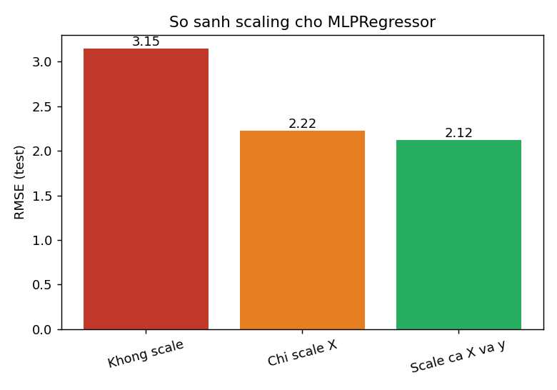
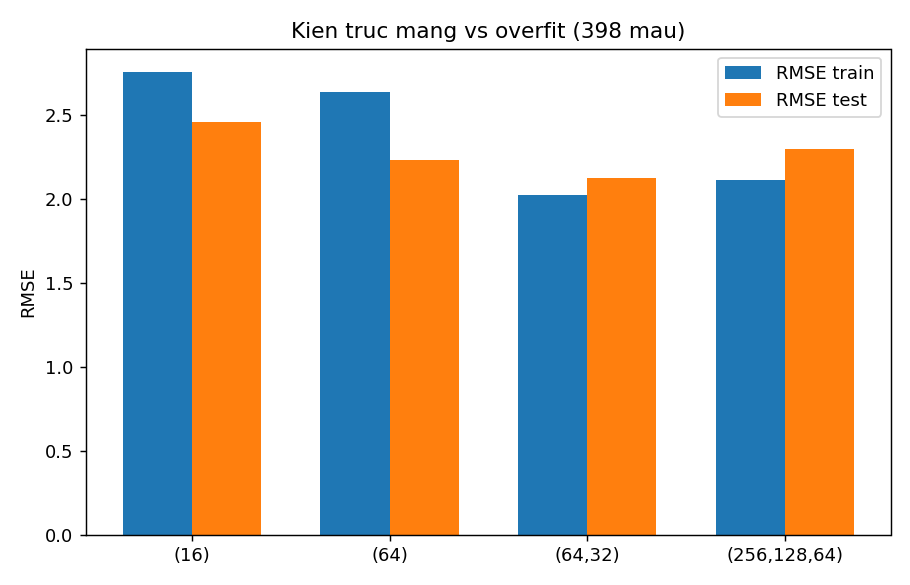
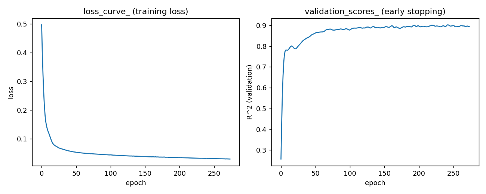
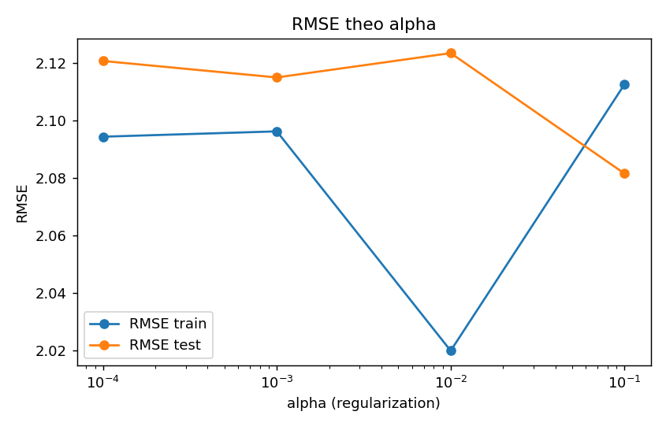

# TT-22 — MLP REGRESSOR
## Dự đoán mức tiêu hao nhiên liệu để tư vấn khách chọn xe

| | |
|---|---|
| 🎓 **Khoá** | HỌC MÁY · Buổi 13 |
| 🧠 **Nhóm** | Mạng nơ-ron cho hồi quy |
| 🔧 **Thuật toán** | MLPRegressor (sklearn) |
| 🏭 **Lĩnh vực** | Ô tô · Tư vấn tiêu dùng |
| 📈 **Kết quả** | R² test = 0,916 (mục tiêu > 0,85 ✅) |

---

## 1. Cách chạy

```bash
pip install -r requirements.txt

# Huấn luyện end-to-end (tự tải Auto MPG từ UCI, lưu model + report)
python src/train.py

# Nếu máy không có mạng hoặc muốn dùng file đã tải sẵn:
python src/train.py --data-path duong/dan/auto-mpg.data
```

Chạy xong sẽ có:
- `models/mlp_reg.joblib` — model cuối cùng (kiến trúc + alpha tốt nhất, đã đóng gói scale X & y)
- `reports/*.png` — toàn bộ biểu đồ (EDA, scale comparison, kiến trúc/overfit, loss curve, alpha sweep)
- `reports/summary.json` — toàn bộ số liệu đo được (dùng để dựng lại các bảng bên dưới)

Notebook `notebooks/mlp_regressor_mpg.ipynb` chạy lại đúng pipeline này theo từng bước,
kèm giải thích tiếng Việt và bảng/biểu đồ hiển thị trực tiếp trong notebook. Notebook mặc
định tự tải dữ liệu từ UCI; nếu cần dùng file cục bộ, đặt biến môi trường
`AUTO_MPG_DATA_PATH` trước khi mở Jupyter.

---

## 2. Bộ dữ liệu

| | |
|---|---|
| **Tên** | Auto MPG (UCI) |
| **Link** | https://archive.ics.uci.edu/dataset/9/auto+mpg |
| **Kích thước** | 398 dòng × 8 cột (sau khi bỏ `car_name`) |
| **Nhãn** | `mpg` (miles per gallon) |

**Xử lý:**
- `horsepower` có 6 giá trị `'?'` → ép kiểu số, điền median.
- `origin` (1=Mỹ, 2=Châu Âu, 3=Nhật) là biến phân loại → one-hot (`origin_usa`, `origin_europe`, `origin_japan`).
- Bỏ cột `car_name` (định danh, không mang tính dự đoán).
- Đổi đơn vị cho người Việt: `L/100km = 235,215 / mpg`.

---

## 3. Baseline

| Model | RMSE test | R² test |
|---|---|---|
| Dummy (mean) | 7,35 | −0,004 |
| Linear Regression | 2,89 | 0,845 |
| Random Forest | 2,17 | 0,912 |

---

## 4. MLP — so sánh scaling (bắt buộc)

| Cách scale | RMSE test | R² test |
|---|---|---|
| Không scale | 3,15 | 0,816 |
| Chỉ scale X | 2,22 | 0,908 |
| Scale cả X và y | **2,12** | **0,916** |

➡️ Không scale khiến mạng hội tụ kém rõ rệt (RMSE cao hơn ~50% so với scale cả X và y).
Scale cả target `y` giúp cải thiện thêm so với chỉ scale X — đúng như dự đoán trong lý thuyết.



---

## 5. So sánh 4 kiến trúc — bằng chứng overfit trên dữ liệu nhỏ

| Kiến trúc | Số tham số | RMSE train | RMSE test | Overfit gap (test−train) |
|---|---|---|---|---|
| (16) | 177 | 2,76 | 2,46 | −0,30 |
| (64) | 705 | 2,64 | 2,23 | −0,41 |
| **(64, 32)** | 2.753 | 2,02 | **2,12** | +0,10 |
| (256, 128, 64) | 43.777 | 2,11 | 2,30 | +0,18 |

➡️ Với chỉ 398 mẫu, mạng lớn nhất (256, 128, 64 — hơn 40 nghìn tham số) không những
không tốt hơn mà còn cho gap dương lớn hơn kiến trúc (64, 32) nhỏ gọn hơn 16 lần — dấu
hiệu overfit rõ ràng dù đã có `alpha` và `early_stopping`. Kiến trúc (64, 32) là điểm
cân bằng tốt nhất trên tập test.



---

## 6. Loss curve

`loss_curve_` (training loss) giảm đều và `validation_scores_` (R² trên tập validation
nội bộ dùng cho early stopping) tăng rồi bão hòa — early stopping kích hoạt đúng lúc,
không để mạng train quá đà.



---

## 7. Khảo sát alpha (regularization)

| alpha | RMSE train | RMSE test |
|---|---|---|
| 1e-4 | 2,09 | 2,12 |
| 1e-3 | 2,10 | 2,11 |
| 1e-2 | 2,02 | 2,12 |
| **1e-1** | 2,11 | **2,08** |

➡️ alpha lớn hơn (1e-1) cho RMSE test thấp nhất — hợp lý vì dữ liệu ít, cần regularize
mạnh để tránh overfit.



---

## 8. So sánh activation

| Activation | RMSE test | R² test |
|---|---|---|
| relu | 2,12 | 0,916 |
| **tanh** | **1,98** | **0,927** |
| logistic | 2,94 | 0,839 |

➡️ `tanh` cho kết quả tốt nhất trên bộ này (dữ liệu đã scale về quanh 0, tanh đối xứng
qua 0 nên phù hợp hơn relu/logistic ở bài toán nhỏ, ít nhiễu này). `logistic` kém nhất —
đúng như cảnh báo ở mục lý thuyết, hàm bị bó hẹp không phù hợp để học quan hệ hồi quy tự do.

---

## 9. ⭐ Bảng so sánh cuối cùng — Linear Regression vs Random Forest vs SVR vs MLPRegressor

| Model | RMSE test | R² test | Thời gian train | Giải thích được |
|---|---|---|---|---|
| Linear Regression | 2,89 | 0,845 | 0,003s | Cao — đọc trực tiếp hệ số |
| Random Forest | 2,17 | 0,912 | 0,39s | Trung bình — `feature_importances_` |
| **SVR** | **1,95** | **0,929** | 0,01s | Thấp — gần như hộp đen |
| MLPRegressor | 2,08 | 0,919 | 0,26s | Thấp — hộp đen, cần SHAP/permutation importance |

---

## 10. Ví dụ quy đổi sang L/100km

Với một xe mẫu trong tập test, model dự đoán **33,6 mpg ≈ 7,0 L/100km**.
Ước tính chi phí xăng/năm nếu chạy 15.000 km/năm, giá xăng 21.000 VND/L:

```
7,0 L/100km × 15.000 km / 100 × 21.000 VND/L ≈ 22.020.000 VND/năm
```

---

## 11. Kết luận trung thực

Trên bộ dữ liệu bảng **chỉ 398 dòng**, MLPRegressor (tốt nhất: kiến trúc (64,32),
alpha=0,1) đạt **R² ≈ 0,92**, gần như ngang bằng — thậm chí SVR còn nhỉnh hơn một
chút — so với Random Forest (R² = 0,912) và SVR (R² = 0,929), trong khi MLP đòi hỏi:

- Bắt buộc scale cả X và y (RF/cây không cần).
- Dò kiến trúc + alpha + activation mới đạt được hiệu năng đó.
- Kém ổn định và khó diễn giải hơn nhiều so với Linear Regression / Random Forest.

**➡️ Với dữ liệu bảng cỡ nhỏ như Auto MPG, MLP không đáng để ưu tiên** so với
Random Forest hoặc SVR — cả hai đều đạt kết quả tương đương hoặc tốt hơn với ít
công sức tinh chỉnh hơn. MLP chỉ thực sự đáng cân nhắc khi dữ liệu lớn hơn nhiều
(xem phần Mở rộng) hoặc khi quan hệ giữa các biến quá phi tuyến để cây nắm bắt tốt.

*Lưu ý:* các số liệu trên phụ thuộc `random_state=42` và phiên bản scikit-learn;
chạy lại `src/train.py` sẽ tái tạo đúng `reports/summary.json` để đối chiếu.

---

## 12. Cạm bẫy đã tránh trong code

| Cạm bẫy | Cách xử lý trong `src/train.py` |
|---|---|
| Activation ở tầng output | `MLPRegressor` mặc định không có activation ở output — không chỉnh sửa |
| Không scale y | Dùng `TransformedTargetRegressor` |
| Mạng quá to với 398 mẫu | So sánh 4 kiến trúc, chọn (64,32) thay vì mạng lớn nhất |
| Không `early_stopping` | `early_stopping=True, n_iter_no_change=30` trong `make_mlp()` |
| `origin` dạng số | One-hot bằng `pd.get_dummies` sau khi map sang tên vùng |
| Kết luận "MLP luôn tốt hơn" | Xem Mục 11 — kết luận dựa trên số đo thật, không phải giả định |

---

## 13. Cấu trúc thư mục

```
TT-22-MLPRegressor-Hieu/
├── README.md
├── notebooks/mlp_regressor_mpg.ipynb
├── src/train.py
├── models/mlp_reg.joblib
├── reports/
│   ├── eda_overview.png
│   ├── scale_comparison.png
│   ├── kien_truc_overfit.png
│   ├── loss_curve.png
│   ├── alpha_sweep.png
│   └── summary.json
└── requirements.txt
```

## 14. Mở rộng (chưa triển khai trong bản nộp này)

1. Chuyển sang PyTorch để thêm Dropout, BatchNorm — so sánh có cải thiện không.
2. Thử với bộ dữ liệu lớn hơn (vd Bike Sharing ~17k dòng) — xác định ngưỡng dữ liệu
   mà MLP bắt đầu thắng cây.
3. Dự báo khoảng tin cậy: train N mạng với seed khác nhau, dùng độ lệch chuẩn giữa
   các dự đoán làm khoảng tin cậy.
