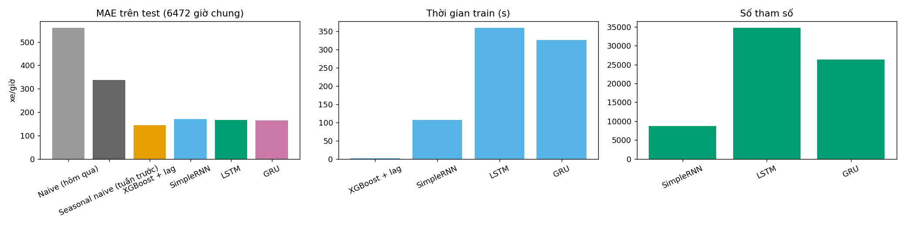
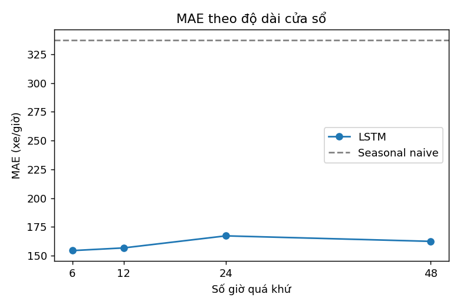
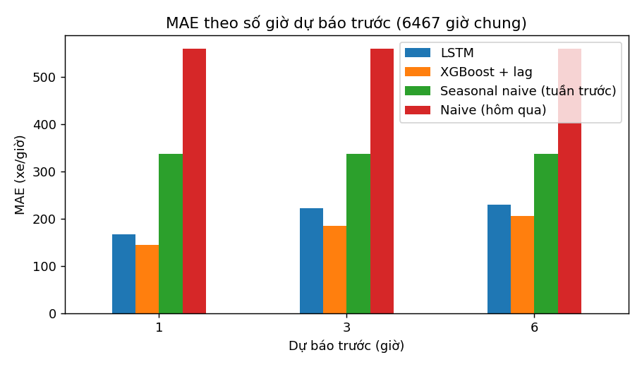
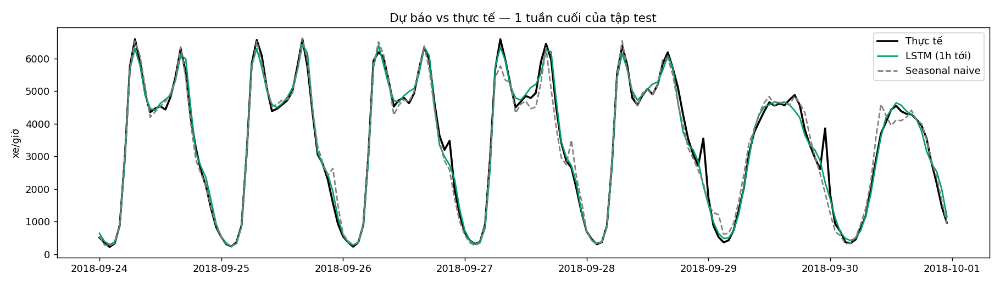
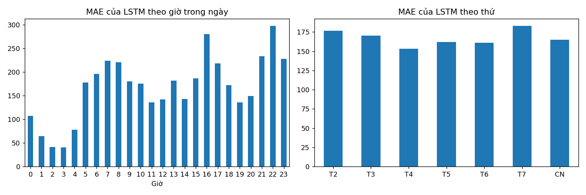

### Xử lý dữ liệu
- Khoảng thời gian: 2012-10-02 → 2018-09-30
- Số dòng gốc: 48204
- (3) Dòng trùng date_time đã khử: 7629
- (2) temp phi lý (<200K) đã lọc: 10
- (2) rain_1h phi lý (>100mm) đã lọc: 1
- (1) Giờ thiếu trong khoảng thời gian: 11976
- (1)   - nội suy (lỗ hổng <= 3h, có cờ is_filled): 2771
- (1)   - giữ trống, cắt đoạn (lỗ hổng > 3h): 9205
- (1) Số đoạn liên tục: 137
- Số giờ dùng được: 43346
- (4) Dòng holiday gốc → số giờ is_holiday=1 sau khi lan ra cả ngày: 61 → 1272

### So sánh với baseline (dự báo 1 giờ tới, MAE/RMSE đơn vị xe/giờ)
| Mô hình | MAE | RMSE | Thời gian train (s) | Số tham số | Số epoch/cây |
|---|---|---|---|---|---|
| Naive (hôm qua) | 560.3 | 1,022.9 | 0.0 | - | 0 |
| Seasonal naive (tuần trước) | 336.8 | 646.2 | 0.0 | - | 0 |
| XGBoost + lag | 144.0 | 223.0 | 1.9 | - | 371 |
| SimpleRNN | 170.3 | 255.5 | 107.0 | 8,705 | 38 |
| LSTM | 167.2 | 251.4 | 359.8 | 34,721 | 40 |
| GRU | 164.0 | 243.3 | 327.0 | 26,337 | 38 |

### Khảo sát độ dài cửa sổ (LSTM)
| Cửa sổ (giờ) | MAE | RMSE | Thời gian train (s) |
|---|---|---|---|
| 6 | 154.4 | 231.6 | 118.4 |
| 12 | 156.7 | 230.4 | 186.8 |
| 24 | 167.2 | 250.9 | 359.8 |
| 48 | 162.4 | 241.2 | 642.1 |

### Dự báo nhiều bước
| Dự báo trước (giờ) | LSTM | XGBoost + lag | Seasonal naive (tuần trước) | Naive (hôm qua) | LSTM tăng so với 1h (%) |
|---|---|---|---|---|---|
| 1 | 167.3 | 144.0 | 337.0 | 559.6 | 0.0 |
| 3 | 221.5 | 185.2 | 337.0 | 559.6 | 32.4 |
| 6 | 229.3 | 205.5 | 337.0 | 559.6 | 37.1 |

### Dự báo vs thực tế (1 tuần cuối tập test)

### Phân tích lỗi (LSTM, 1h tới)
- Giờ sai nhiều nhất: 22h (298), 16h (280), 21h (234)
- Thứ sai nhiều nhất: T7 (183), T2 (177)
- Ngày sai nhiều nhất: 2018-04-14 (585), 2018-03-05 (479), 2018-01-22 (467), 2018-05-21 (329), 2018-04-15 (298)

### Kết luận
- LSTM **thắng** seasonal naive: MAE 167 so với 337 xe/giờ (giảm 50.3%).
- XGBoost + lag features cho MAE 144 (LSTM: 167) và train nhanh hơn ~192 lần → nên ưu tiên XGBoost khi triển khai.
- Trong 3 kiến trúc hồi quy, **GRU** có MAE thấp nhất (164); SimpleRNN 170 · LSTM 167 · GRU 164.
- Cửa sổ tốt nhất: **6 giờ** (MAE 154).
- LSTM dự báo 6h tới có MAE tăng 37% so với 1h tới.
- Mức tham chiếu của đề bài cho 1 giờ tới: MAE ~250–400 xe/giờ.